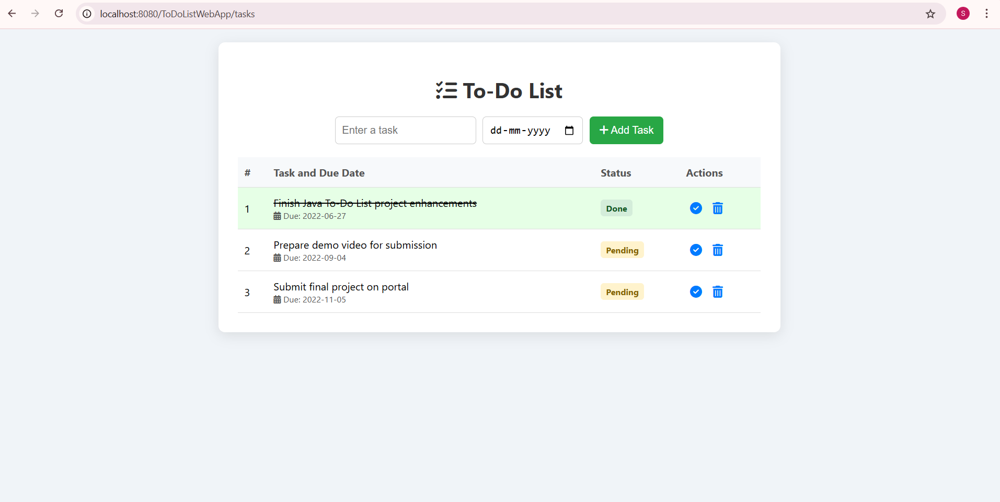

# 📋 To-Do List Web App (Java Servlet Based)
A simple and interactive 🧑‍💻 To-Do List Web Application built using Core Java, JSP, Servlets, and HTML/CSS. Users can add 📝 tasks with 📅 due dates, mark them ✅ as completed, and 🗑 delete them — all through a clean, responsive UI.

✨ Features

➕ Add new tasks with due date

📆 View tasks in a sortable table

✅ Mark tasks as completed

🗑 Delete tasks anytime

🎨 Styled UI with icons and colors

